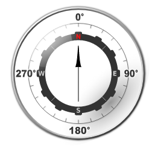

# Cumulocity IoT Compass widget

## Features
**Realtime:** Realtime direction updates from defined measurement

## Installation

### Runtime Widget Deployment?

* This widget supports runtime deployment. Download the [Runtime Binary](https://github.com/SoftwareAG/cumulocity-compass-widget/releases/download/1.0.0/compass-widget.zip) and follow runtime deployment instructions from [here](https://github.com/SoftwareAG/cumulocity-runtime-widget-loader).

## Quickstart
This guide will teach you how to add the widget in your existing or new dashboard.

NOTE: This guide assumes that you have followed the [installation](https://github.com/SoftwareAG/cumulocity-runtime-widget-loader) instructions

1. Open the Application Builder application from the app switcher (Next to your username in the top right)
2. Add a new dashboard or navigate to an existing dashboard
3. Click `Add Widget`
4. Search for `Compass`
5. See below for the configuration options

### Configuration options

1. Select your device in the `Target Assets or Devices` field
2. Select the device measurement and fragment in the `Measurement` dropdown
3. Click `Save`

The compass widget will refresh each time a new measurement value is sent for the device.

### Development - to enhance and test this widget in your local environment
1. Clone the repository on your local machine using `git clone https://github.com/SoftwareAG/cumulocity-compass-widget.git`.
2. Run `npm install` to download the module dependencies.
3. Run `c8ycli server -u https://your_tenant_url` to start the server.
4. Go to `http://localhost:9000/apps/cockpit/` in the browser to view and test your changes.
5. (Optional) push the changes back to this repository.

### Build - to create a new build of the compass-animation widget for the Runtime Widget Loader
1. Finish the development and testing on your local machine.
2. Run `gulp` to start the build process.
3. Use the `compass-widget.zip` file in the `dist` folder as your distribution file.

------------------------------

This widget is provided as-is and without warranty or support. They do not constitute part of the Software AG product suite. Users are free to use, fork and modify them, subject to the license agreement. While Software AG welcomes contributions, we cannot guarantee to include every contribution in the master project.
_____________________
For more information you can Ask a Question in the [TECHcommunity Forums](http://tech.forums.softwareag.com/techjforum/forums/list.page?product=cumulocity).

You can find additional information in the [Software AG TECHcommunity](http://techcommunity.softwareag.com/home/-/product/name/cumulocity).

